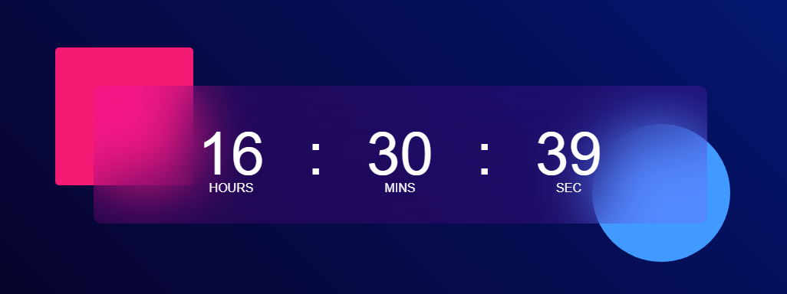

# Digital Clock

This is a simple and responsive digital clock built using **HTML**, **CSS**, and **JavaScript**.

## 🔧 Features

- Displays current hours, minutes, and seconds
- Responsive design for desktop and mobile devices
- Stylish glassmorphism effect using modern CSS
- Pure JavaScript for time updates

## 📁 Project Structure

```
digital-clock/
│
├── index.html       # Structure of the digital clock
├── style.css        # Styles with glass effect and responsive design
└── script.js        # JavaScript for real-time clock updates
```

## 🚀 How to Use

1. Clone the repository or download the files.
2. Open `index.html` in your web browser.
3. The digital clock will start displaying the current system time.

## 📱 Responsive Design

The layout adapts to different screen sizes using media queries, making it suitable for both desktop and mobile devices.

## 🛠️ Customization

You can easily customize:
- Font size and styles in `style.css`
- Clock update logic in `script.js`

## 📸 Preview

 

## 📄 License

This project is open-source and free to use for personal or educational purposes.
